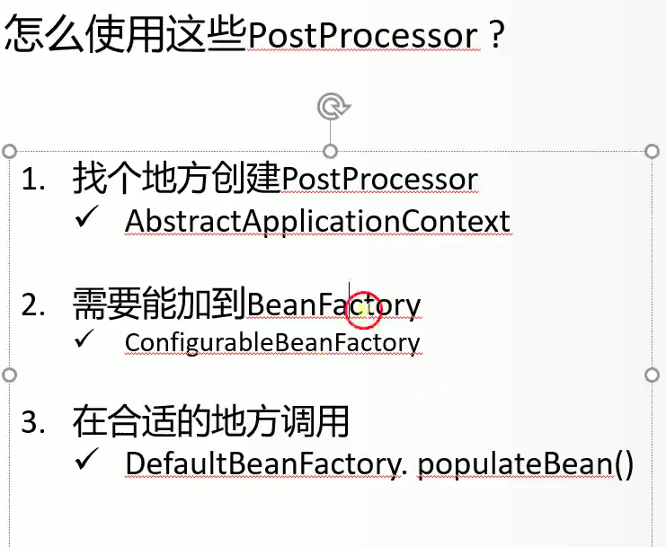

<!--ts-->

   * [litespring](#litespring)
   * [前言](#前言)
   * [0 单元测试](#0-单元测试)
   * [1. 概述](#1-概述)
      * [1.1 介绍Spring IoC, AOP](#11-介绍spring-ioc-aop)
      * [1.2 介绍TDD开发方式， 重构的方法](#12-介绍tdd开发方式-重构的方法)
      * [1.3 第一个测试用例](#13-第一个测试用例)
   * [2. setter-injection](#2-setter-injection)
   * [3. constructor-injection](#3-constructor-injection)
   * [4. auto-scan](#4-auto-scan)
      * [4.1 java注解](#41-java注解)
      * [4.2 思路](#42-思路)
         * [4.2.1 读取XML文件](#421-读取xml文件)
         * [4.2.2 扫描指定的包](#422-扫描指定的包)
            * [4.2.2.1 实现PackageResourceLoader](#4221-实现packageresourceloader)
            * [4.2.2.2 使用ASM读取Resource中的注解](#4222-使用asm读取resource中的注解)
            * [4.2.2.3 创建BeanDefinition](#4223-创建beandefinition)
         * [4.2.3 根据BeanDefinition创建Bean的实例，并注入](#423-根据beandefinition创建bean的实例并注入)
   * [5. aop](#5-aop)

<!-- Added by: anapodoton, at: Thu Feb 13 23:58:01 CST 2020 -->

<!--te-->

# litespring

# 前言

刘欣老师的这个版本最好使用Java-7来做。

# 0 单元测试

# 1. 概述

http://repo.spring.io/libs-release/org/springframework/spring/

https://github.com/dachengxi/spring-framework-3.2.18.RELEASE

Spring 3.2.18

p means package，c means class，i means interface, f means function,a means abstract class

- beans(p):单纯的bean的定义，bean的属性和bean的构造函数
  - factory(p)：存放所有的工厂接口，工厂模式 
    - support(p)：factory的实现
      - DefaultBeanFactory(c):BeanFactory的默认实现
      - GenericBeanDefinition(c):GenericBeanDefinition is a one-stop shop for standard bean definition purposes.
      - BeanDefinitionRegistry(I):Interface for registries that hold bean definitions
      - DefaultSingletonBeanRegistry(C):单例bean注册的通用实现
      - ConstructorResolver(C):构造方法或者工厂类初始化bean的委托类
      - BeanNameGenerator(I):Strategy interface for generating bean names for bean definitions.
    - xml
      - XmlBeanDefinitionReader：Bean definition reader for XML bean definitions.
    - config:factory的配置
      - ConfigurableBeanFactory(I):提供Factory的配置功能
      - SingletonBeanRegistry(I):单例类注册
      - RuntimeBeanReference(C):Immutable placeholder class used for a property value object when it's a reference to another bean in the factory, to be resolved at runtime.
      - TypedStringValue(C):Holder for a typed String value. Can be added to bean definitions in order to explicitly specify a target type for a String value.
      - DependencyDescriptor(C):对依赖的描述符
      - AutowireCapableBeanFactory(I):定义了bean的自动装配规则
      - BeanPostProcessor(I):可以在bean初始化前后做操作
      - InstantiationAwareBeanPostProcessor(C):对bean的实例化做一些操作
    - annotation:注解相关
      - InjectionMetadata(C):Internal class for managing injection metadata.
      - AutowiredAnnotationProcessor(C):封装了InjectionMetadata
    - BeanFactory(I):The root interface for accessing a Spring bean container
    - BeanCreationException(C):Exception thrown when a BeanFactory encounters an error when attempting to create a bean from a bean definition.
    - BeanDefinitionStoreException(C): Exception thrown when a BeanFactory encounters an invalid bean definition:
    - BeanDefinitionValueResolver(C):用于把beanID生成相应的实例
  - BeanDefinition(I):BeanDefinition中保存了我们的Bean信息
  - BeansException(C):Abstract superclass for all exceptions thrown in the beans package and subpackages.
  - PropertyValue(C):Object to hold information and value for an individual bean property.
  - propertyeditors
    - CustomNumberEditor(C):把字符串转化为整数
    - CustomBooleanEditor(C):字符串转化为boolean值
  - TypeConverter(I):Interface that defines type conversion methods.
  - TypeMismatchException(C):Exception thrown on a type mismatch when trying to set a bean property.
  - SimpleTypeConverter(C):封装了类型转换
  - ConstructorArgument(C): Holder for constructor argument values, typically as part of a bean definition.
- context
  - ApplicationContext(I):包含BeanFactory的所有功能，增加了支持不同信息源，可以访问资源，支持应用事件机制等
  - support
    - AbstractApplicationContext(a):ApplicationContext接口的通用实现
    - ClassPathXmlApplicationContext:解析xml文件并生成bean实例
    - FileSystemXmlApplicationContext:解析xml文件并生成bean实例
  - annotation
    - ClassPathBeanDefinitionScanner:创建ScannedGenericBeanDefinition，并且注册到BeanFactory中。
    - AnnotationBeanNameGenerator:BeanNameGenerator的实现,用来生成BeanID。
    - ScannedGenericBeanDefinition(C):扫描出来的类
- core
  - io
    - Resource(I):Interface for a resource descriptor that abstracts from the actual type of underlying resource, such as a file or class path resource.
    - ClassPathResource:Uses either a given ClassLoader or a given Class for loading resources.
    - FileSystemResource:对java.io.File类型资源的封装，只要是跟File打交道的，基本上都可以使用FileSystemResource。
    - support
      - PackageResourceLoader(C):把一个package下面的class 变成resource
  - type
    - classreading
      - ClassMetadataReadingVisitor(C):读取类的信息
      - AnnotationMetadataReadingVisitor:读取注解的信息
      - MetadataReader:Simple facade for accessing class metadata.
      - SimpleMetadataReader:MetadataReader的实现
- stereotype:注解的定义
  - Component(@interface):Indicates that an annotated class is a "component".
  - Autowired(@interface):Marks a constructor, field, setter method or config method as to be autowired by Spring's dependency injection facilities.
- aop
  - Pointcut(I):切入点，定义了哪些连接点需要被织入需要被织入横切逻辑
  - MethodMatcher(I):该接口定义了静态方法匹配器和动态方法匹配器
  - aspectj
    - AspectJExpressionPointcut(C):uses the AspectJ weaver to evaluate a pointcut expression.
    - AspectJBeforeAdvice(C):
    - AbstractAspectJAdvice(C):
  - config
    - MethodLocatingFactory(C):根据bean的名字和方法名，定位到Method.
    - AspectInstanceFactory(C):
    - ConfigBeanDefinitionParser(C):aop标签解析器
  - framework
    - ReflectiveMethodInvocation(C):Spring's implementation of the AOP Alliance.
    - AopProxyFactory(I):
    - AopConfig(I):承载生成代理对象所需要的必要信息，比如相关目标类、Advice、Advisor等.
    - AopConfigSupport(C):
    - CglibProxyFactory(C):CGLIB-based  AopProxyFactory implementation for the Spring AOP framework.

## 1.1 介绍Spring IoC, AOP

Spring 的本质系列(1) -- [依赖注入](https://mp.weixin.qq.com/s?__biz=MzAxOTc0NzExNg==&mid=2665513179&idx=1&sn=772226a5be436a0d08197c335ddb52b8&scene=21#wechat_redirect)

IoC（Inversion of Control，控制反转）和DI（(Dependency Injection，依赖注入）是一个含义。


Spring本质系列(2)-[AOP](https://mp.weixin.qq.com/s?__biz=MzAxOTc0NzExNg==&mid=2665513187&idx=1&sn=f603eee3e798e79ce010c9d58cd2ecf3&scene=21#wechat_redirect)

AOP（Aspect Oriented Programming）


## 1.2 介绍TDD开发方式， 重构的方法

## 1.3 第一个测试用例

给定一个xml配置的文件（内含bean的定义），能够 从中获取：

1. Bean的定义
2. Bean 的实例

**testcase-1**

| commit                                                 | 功能                                                    | 备注                                                |
| ------------------------------------------------------ | ------------------------------------------------------- | --------------------------------------------------- |
| 测试用例和空的类实现                                   | 实现了根据xml文件的beanID生成相应实例的框架             |                                                     |
| 实现DefaultBeanFactory                                 | 实现了根据xml文件的beanID生成相应实例的框架             |                                                     |
| 引入Exception                                          | 分为BeanCreationException和BeanDefinitionStoreException |                                                     |
| 重构，提取BeanDefinitonRegistry接口                    | 实现XmlBeanDefinitionReader                             | SRP，单一职责原则，需要将DefaultBeanFactory进行拆解 |
| 实现ApplicationContext和ClassPathXmlApplicationContext | 传入配置文件和beanID即可获得bean实例                    |                                                     |
| 实现Resource的抽象                                     | ClassPathResource和FileSystemResource实现               |                                                     |
| 提取出resource后的重构代码                             | XmlBeanDefinitionReader修改                             |                                                     |
| 实现FileSystemXMLApplicationContext                    | FileSystemXMLApplicationContext实现                     |                                                     |
| 实现scope                                              | 根据scope的类型设计实例的生成方式                       |                                                     |

1. 首先实现了DefaultBeanFactory，然后引入异常处理。


2. 然后由 [SRP，单一职责原则]，需要将DefaultBeanFactory进行拆解。将读取解析xml文件的功能拆分出去。首先想到的是在接口BeanFactory中新增registerBeanDefinition(),其对应实现为XMLBeanDefinitionReader 。这样DefaultBeanFactory负责生成实例，XMLBeanDefinitionReader负责读取并解析xml。如下图所示：


3. 但是现在还存在问题，为了安全考虑，我们不想把getBeanDefinition()和registerBeanDefinition()暴露给用户使用，所以我们重新定义了BeanDefinitionRegistry接口，如下图所示：


4. 事实上，上面还是显得略为麻烦，我们希望传入beanID就可以得到bean的实例，下面我们将定义一个接口，ApplicationContext，其对应实现为ClassPathXmlApplicationContext。


5. 下面我们继续进行抽象，我们需要**判断传入的配置文件是否真的存在**(请注意，这个是支路，不是主干)。我们既可以从ClassPathResource读取配置文件（借助于ClassLoader），也可以从FileSystemResource(借助于FileSystem)配置文件，所以我们定义一个Resource接口，及其两个实现ClassPathResource和FileSystemResource，如下图所示：


6. 下面我们需要把Resource提取出来，进行代码的重构，主要修改XmlBeanDefinitionReader。

7. 下面我们需要回到主干，接着看ApplicationContext相关的。实现FileSystemXMLApplicationContext和，关系图如下所示：


8. 但是我们发现FileSystemXMLApplicationContext和ClassPathXmlApplicationContext有很多重复的方法，回想起我们学习过的设计模式中的  【模板方法】，可以完美的解决该问题。我们可以定义一个抽象类AbstractApplicationContext，FileSystemXMLApplicationContext和ClassPathXmlApplicationContext为其子类，关系如下所示：

   

   

9. 上面的实现中，我们的ClassLoader都是获取的默认的，不支持用户来传入，下面我们来进行优化，支持用户传入一个ClassLoader。我们最开始是想把setBeanClassLoader放在BeanFactory接口中，但是这样不是很好，频繁使用的接口，最好只有get方法，尽量少的set方法。所以，我们定义了一个接口，ConfigurableBeanFactory。关系如下图所示：


指的注意的是，Spring的实现和我们是有所不同的，Spring还提供ResourceLoader的功能，具体见下图所示：


10. 实现scope。Spring中的scope的含义如下：

    | scope类别      | 含义                   |
    | -------------- | ---------------------- |
    | singleton      | 单一实例               |
    | prototype      | 每次都重新生成一个实例 |
    | request        |                        |
    | session        |                        |
    | global session |                        |

    

下面引入单例的实现：


我们首先重新定义了BeanDefinition，并且让GenericBeanDefinition实现了BeanDefinition 接口，，实现了接口中的方法。

```java
// 定义了Bean的样子，添加了SCOPE_SINGLETON，SCOPE_PROTOTYPE和SCOPE_DEFAULT字段
//  新增了2个判断方法，setScope和getScope方法
public interface BeanDefinition {
    public static final String SCOPE_SINGLETON = "singleton";
    public static final String SCOPE_PROTOTYPE = "prototype";
    public static final String SCOPE_DEFAULT = "";

    public boolean isSingleton();
    public boolean isPrototype();
    String getScope();
    void setScope(String scope);

    String getBeanClassName();
}
```

然后定义了SingletonBeanRegistry接口，让DefaultSingletonBeanRegistry 继承SingletonBeanRegistry，完成了beanName和singletonObject的映射。

再然后让DefaultBeanFactory 继承DefaultSingletonBeanRegistry ，在getBean的时候，判断bd如果是单例，并且不存在，则创建，否则直接使用bd实例。

最后，不要忘记在XmlBeanDefinitionReader的构造方法中设置SCOPE_ATTRIBUTE。

11. 总结


| 类/接口                      | 功能                                                         | 备注                |
| ---------------------------- | ------------------------------------------------------------ | ------------------- |
| BeanDefinition               | 封装了Bean的所有的定义                                       |                     |
| GenericBeanDefinition        | BeanDefinition的其中一个具体实现                             |                     |
| BeanDefinitionRegistry       | 用于存放BeanDefinition                                       |                     |
| XmlBeanDefinitionReader      | 解析xml，让beanID和BeanDefinition一一对应                    |                     |
| BeanFactory                  | 根据beanID生成相应的实例                                     |                     |
| ConfigurableBeanFactory      | BeanFactory的子例，用于setBeanClassLoader和getBeanClassLoader | 为了设置ClassLoader |
| SingletonBeanRegistry        | 支持单例                                                     | 为了支持scope       |
| DefaultSingletonBeanRegistry | SingletonBeanRegistry的实现                                  |                     |
| **DefaultBeanFactory**       | 最核心，逻辑                                                 | 集大成者            |

为了方便客户的使用，我们抽象出了ApplicationContext

| 类/接口                         | 功能                             | 备注               |
| ------------------------------- | -------------------------------- | ------------------ |
| ApplicationContext              |                                  | 方便客户使用       |
| AbstractApplicationContext      |                                  | 使用模板的设计模式 |
| ClassPathXmlApplicationContext  | AbstractApplicationContext的子类 |                    |
| FileSystemXmlApplicationContext | AbstractApplicationContext的子类 |                    |
| Resource                        | 定义了资源的抽象                 |                    |
| ClassPathResource               | 从路径获取资源                   |                    |
| FileSystemResource              | 从文件获取资源                   |                    |

# 2. setter-injection

在上面，我们用构造函数的方式实现了类的注入，正如我们所知道的，spring IOC的常见注入方式分为3中，分别是构造函数，setter方式和注解的方式，这节课我们来学习注解的方式。

| 注入方式 | 优点 | 缺点 |
| -------- | ---- | ---- |
| 构造函数 |      |      |
| setter   |      |      |
| 注解     |      |      |

1. 实现PropertyValue相关的代码(获取Bean的定义)

   我们要表达petstore-v2.xml中的property属性，为此引入了PropertyValue来表示property属性。
   
   

我们使用PropertyValue来表示property属性。值得注意的是，值分为两种，一种是引用，另外一种是值，所以我们需要getPropertyValues方法把reference进行转换。


在BeanDefinition中定义了getPropertyValues接口，在GenericBeanDefinition中实现了该方法。

最后在XmlBeanDefinitionReader完成对petstore-v2.xml的解析。

2. 实现BeanDefinitionResolver

   Resolver的含义是把名称变成一个实例的过程。我们新增了BeanDefinitionResolver，用于把beanID生成相应的实例。

3. 实现setter注入

   拆分了getBean，独立出来createBean，createBean分为instantiateBean和populateBean，前者用来创建实例，后者用来设置属性。其中populateBean函数比较重要，使用了反射的机制，来调用相应的bean的set方法。通过pd.getWriteMethod().invoke(bean, convertedValue)来实现的。
   
4. 实现了TypeConverter，并在DefaultBeanFactory中调用

   由于我们在xml中定义的值都属于字符串的值，但是我们实际需要的可能是Interger,Boolean,Date或者其他类型的。

   我们首先创建CustomNumberEditorTest和CustomBooleanEditorTest，并且实现CustomNumberEditor和CustomBooleanEditor。

   

然后定义TypeConverter 接口，并定义其实现SimpleTypeConverter。

5. 总结

在这里，我们主要学习了Setter 注入。

首先，我们引入了新的概念PropertyValue(来代表xml文件中的property属性)，包含RuntimeBeanReference和TypedStringValue。

然后，我们用BeanDefinitionResolver去resolve相应的bean，生成实例，并实现setter注入。

最后，我们用TypeConverter将字符的值转化为整形，Boolean值等类型。

| 设计模式                              | 定义 | 备注                                                         |
| ------------------------------------- | ---- | ------------------------------------------------------------ |
| 开闭原则（open-close）                |      | AbstractApplicationContext满足了对修改封闭，对扩展开放的原则 |
| 单一职责原则（single responsibility） |      | XmlBeanDefinitionReader负责解析xml                           |
| 替换原则（liskov）                    |      | 敏捷软件开发，原则，模式与实践                               |
| 接口隔离原则（interface seperation）  |      | DefaultBeanFactory                                           |
| 依赖隔离                              |      |                                                              |

# 3. constructor-injection


注意，setter注入和构造函数注入的区别和联系。


# 4. auto-scan

1. 实现PackageResourceLoader,把一个package下面的class 变成resource。
2. 实现两个Visitor：ClassMetadataReadingVisitor和AnnotationMetadataReadingVisitor，用于读取类和注解的信息。(使用ASM读取类的Metadata)
3. 实现SimpleMetadataReader，封装上面两个Visitor。
4. 实现Scanner。读取xml文件，把标记为@Component 的类，创建ScannedGenericBeanDefinition，并且注册到BeanFactory中。AnnotationBeanNameGenerator用来生成bean的名字(给auto-scan的Bean 命名： BeanNameGenerator)。
5. 实现DependencyDescriptor和InjectioMetadata。DependencyDescriptor用于描述依赖的字段，InjectioMetadata则把注入到targetClass中。
6. 实现AutowiredAnnotationProcessor，可以方便的创建InjectioMetadata。(用AutowiredAnnotationProcessor实现注入)
7. 实现BeanPostProcessor。

在学习之前，我们需要先学习下ASM的相关知识。

[ASM： 一个低调成功者的自述](https://mp.weixin.qq.com/s?__biz=MzAxOTc0NzExNg==&mid=2665513528&idx=1&sn=da8b99016aeb4ede2e3c078682be0b46&chksm=80d67a7bb7a1f36dbbc3fc9b3a08ca4b9fae63dbcbd298562b9372da739d5fa4b049dec7ed33&scene=21#wechat_redirect)


访问者模式Visitor：


ClassMetadataReadingVisitor用于读取类的信息，AnnotationMetadataReadingVisitor用于读取注解的信息。

截至到现在，我们事实上已经实现了相关的功能，但是太过于底层，使用起来很不方便，下面我们的目标是进行封装。我们在**SimpleMetadataReader**中的构造函数封装了asm的基本操作。


## 4.1 java注解


[java注解](https://mp.weixin.qq.com/s?__biz=MzAxOTc0NzExNg==&mid=2665513930&idx=1&sn=f1f345124124958ca798460839cbbd17&chksm=80d67b89b7a1f29f18b099c7e57c117a050be6dc9575b780bef8706d4749fd648ba4e11c0a79&scene=21#wechat_redirect)

## 4.2 思路

### 4.2.1 读取XML文件


### 4.2.2 扫描指定的包

**把标记为@Component 的类，创建BeanDefinition**

#### 4.2.2.1 实现PackageResourceLoader

 把一个package下面的class 变成resource。

#### 4.2.2.2 使用ASM读取Resource中的注解

我们首先实现了实现两个Visitor：

- ClassMetadataReadingVisitor用于读取类的信息。
- AnnotationMetadataReadingVisitor用于读取注解的信息。

但是直接用Visitor进行操作，太麻烦。接着我们实现了SimpleMetadataReader，来对Visitor进行封装，方便的读取类的信息和类的注解。

#### 4.2.2.3 创建BeanDefinition


本质上我们生成了BeanDefinition。我们为了避免污染GenericBeanDefinition，所以我们专门定义一个新的接口AnnotatedBeanDefinition，用来表示扫描出来的类，最后我们让ScannedGenericBeanDefinition来表示扫描出来的类的信息。


我们在之前的操作中，在xml文件中都是定义了BeanID的，形如<bean id="itemDao" class="org.litespring.dao.v3.ItemDao">这种，我们利用BeanFactory中提供的getBean(String beanID)方法就可以得到bean的实例。但是我们现在是没有BeanID的，为了得到实例，我们定义了BeanNameGenerator接口来处理这个问题，其对应实现为AnnotationBeanNameGenerator。AnnotationBeanNameGenerator的思路是：判断被@Component标记的字段有无value属性，如果有，则把value的值返回；如果没有，则把该字段的首字母变为小写，作为beanID返回。如AccountDao变为accountDao作为BeanID。


综上：我们使用ClassPathBeanDefinitionScanner从包下获得BeanDefinition，使用ScannedGenericBeanDefinition获得元数据。

### 4.2.3 根据BeanDefinition创建Bean的实例，并注入


上面我们处理了@Component注解，下面我们来处理@Autowired注解。


DependencyDescriptor表示的是对依赖的描述符，我们只实现了字段的描述，对于MethodParameter用于构造函数和set函数的情况，如上图，我们没有进行实现。


为了实现接口最小化的原则，我们并不想把resolveDependency()接口放在BeanFactory接口中，所以我们设计了如下的继承体系。


下面我们进行封装。


事实上，我们通过InjectionMetadata来获取还是十分麻烦的，下面我们进行进一步的封装。我们实现了AutowiredAnnotationProcessor，来封装了InjectionMetadata。


到这里，我们终于完成了所有的准备工作，下面可以开始使用了。

我们需要先了解下bean的生命周期。




我们首先使用DependencyDescriptor来获取对某个字段的描述。然后在DefaultBeanFactory中通过resolveDependency(Depen dencyDescriptor descriptor)来把标记为@Autowired的字段进行实例化。

然后我们使用new AutowiredFieldElement(Field f,boolean required,AutowireCapableBeanFactory factory)的方式创建注解的元素，然后使用new InjectionMetadata(clz,elements)创建了实例，最后使用metadata.inject(Object target)把meta注入到target对象中。

# 5. aop

1. 定义AspectJExpressionPointcut。来实现了PoinCut(切入点，定义了哪些连接点需要被织入需要被织入横切逻辑)和MethodMatcher接口。
2. 实现MethodLocatingFactory。根据bean的名字和方法名，获取BeanDefinition,继而获取到bean的字节码，最后定位到Method.
3. 实现**ReflectiveMethodInvocation**(保证拦截器按顺序执行，实现Advice按顺序执行),这个是核心。
4. 实现AopProxyFactory:给定一个AopConfig,使用Cglib生成一个对象的代理；
5. 引入FactoryBean和BeanFactoryAware。(区分FactoryBean和BeanFactory，前者是用来自定义Bean的创建逻辑)
6. 创建合成的BeanDefinition:从xml中创建BeanDefinition。主要依靠ConfigBeanDefinitionParser这个类。
7. 从“合成”Bean定义创建Bean实例；
8. 用AspectJAutoProxyCreator组合所有功能;
9. 实现Java动态代理aop。

接下来我们来看aop。

首先我们看下，**为什么要实现aop技术**？如下图所示，我们的用户管理，订单管理，支付管理，可能都需要日志，安全这些功能，在传统的实现中，一旦日志中的代码修改，那么我们的用户管理，订单管理都需要修改，这是不符合实际的，我们希望，日志，安全的修改不影响我们的业务代码，我们希望使用**xml或者注解**的形式，来配置二者之间的关系。


我们接着来看**如何实现aop**？

我们有2中方案，1是在编译器来实现，把日志功能在编译器放到业务代码，这样的缺点是致命的，我们必须有源代代码才可以做到，这在实际中是不可能的。

第二种方案是在运行期来做手脚。运行时来动态生成类，问题在于java字节码一旦装入方法区就无法修改，我们如何进行增强呢？一种方案是使用**继承**的技术。在运行时动态生成一个类，继承待增强的类。另外一种方案是使用**动态代理**的技术，定义一个借口，然后实现其兄弟类来实现。


接下来我们还需要复习AOP的术语：


举个例子：

“切面“类(Aspect)，是一个普通的java类，不用实现什么“乱七八糟”的接口。如下所示：


我们想达到的目的只这样的： 对于com.coderising这个包中所有类的execute方法， 在方法调用之前，需要执行Transaction.beginTx()方法， 在调用之后， 需要执行Transaction.commitTx()方法。

“对于com.coderising这个包中所有类的execute方法” ， 用一个时髦的词来描述就是**切入点（PointCut）** , 它可以是一个方法或一组方法（可以通过通配符来支持，你懂的）。

”在方法调用之前/之后 ， 需要执行xxx“ , 用另外一个时髦的词来描述就是**通知（Advice）**

- *Aspect*: a modularization of a concern that cuts across multiple classes. Transaction management is a good example of a crosscutting concern in J2EE applications. In Spring AOP, aspects are implemented using regular classes (the [schema-based approach](https://docs.spring.io/spring/docs/2.5.x/reference/aop.html#aop-schema)) or regular classes annotated with the `@Aspect` annotation (the [`@AspectJ` style](https://docs.spring.io/spring/docs/2.5.x/reference/aop.html#aop-ataspectj)).

  - [**What Is Aspect-Oriented Programming?**](https://docs.jboss.org/aop/1.0/aspect-framework/userguide/en/html/what.html)
  - 如果把这个业务功能看成一层层面包的话， 这些日志/安全/事务 像不像一个个“切面”(Aspect) 。形如TransactionManager。

- *Join point*: a point during the execution of a program, such as the execution of a method or the handling of an exception.  **A join point *always* represents a method execution**.表示一个方法的执行。

- *Pointcut*: a predicate that matches join points. Advice is associated with a pointcut expression and runs at any join point matched by the pointcut (for example, the execution of a method with a certain name). The concept of join points as matched by pointcut expressions is central to AOP, and Spring uses the AspectJ pointcut expression language by default.

  和Join point相匹配。**pointCut形如PetStoreService的placeOrder()方法。**

  

- *Advice*: action taken by an aspect at a particular join point. Different types of advice include "around," "before" and "after" advice. (Advice types are discussed below.) Many AOP frameworks, including Spring, model an advice as an *interceptor*, maintaining a chain of interceptors *around* the join point.类似于拦截器的作用。

- *Introduction*: declaring additional methods or fields on behalf of a type. Spring AOP allows you to introduce new interfaces (and a corresponding implementation) to any advised object. For example, you could use an introduction to make a bean implement an `IsModified` interface, to simplify caching. (An introduction is known as an inter-type declaration in the AspectJ community.)

- *Target object*: object being advised by one or more aspects. Also referred to as the *advised* object. Since Spring AOP is implemented using runtime proxies, this object will always be a *proxied* object.

- *AOP proxy*: an object created by the AOP framework in order to implement the aspect contracts (advise method executions and so on). In the Spring Framework, an AOP proxy will be a JDK dynamic proxy or a CGLIB proxy.

- *Weaving*: linking aspects with other application types or objects to create an advised object. This can be done at compile time (using the AspectJ compiler, for example), load time, or at runtime. Spring AOP, like other pure Java AOP frameworks, performs weaving at runtime.

Types of advice:

- *Before advice*: Advice that executes before a join point, but which does not have the ability to prevent execution flow proceeding to the join point (unless it throws an exception).
- *After returning advice*: Advice to be executed after a join point completes normally: for example, if a method returns without throwing an exception.
- *After throwing advice*: Advice to be executed if a method exits by throwing an exception.
- *After (finally) advice*: Advice to be executed regardless of the means by which a join point exits (normal or exceptional return).
- *Around advice*: Advice that surrounds a join point such as a method invocation. This is the most powerful kind of advice. Around advice can perform custom behavior before and after the method invocation. It is also responsible for choosing whether to proceed to the join point or to shortcut the advised method execution by returning its own return value or throwing an exception.

aop的基本概念是上面这些，接着我们来看pointcut。我们需要使用一个类来表示下图中的<aop:poincut id="">。同时我们还需要**给定一个类的方法，看是否符合pointcut的表达式，**所以我们抽象出了MethodMatcher来表示。关系如下所示：


我们定义了AspectJExpressionPointcut，来实现了PoinCut和MethodMatcher接口。 


接着我们来看另外的点。MethodLocatingFactory用来定位Method，根据bean的名字和方法名(tx,start)，定位到这个Method，然后通过反射调用。


下一个重点：实现指定次序的链式调用。

- 给定一个对象(petStoreService)和方法(placeOrder) + 若干拦截器；

- 目标：拦截器能够以正确的次序执行。
  - beforeXXX;
  - placeOrder;
  - afterXXX;

 下面我们实现拦截器。先来看下spring定义的拦截器。


我们需要实现一个关键的类：ReflectiveMethodInvocation，保证拦截器按顺序执行。主要是使用了递归的功能。我们的ReflectiveMethodInvocation是MethodInvocation的实现。


下面我们将把CGLIB和链式拦截器调用进行结合,实现AopProxyFactory。核心函数是getProxy(ClassLoader classLoader)，返回了一个被CGLIB增强的实例，如org.litespring.service.v5.PetStoreService@458d7519。长成这样。


我们来总结下，到目前为止，实现了什么功能：

- 根据Bean的名称和方法名，获取这个Method对象(MethodLocatingFactory);
- 给定一个类的方法，判断该方法是否符合poincut的表达式(AspectJExpressionPointcut);
- 实现了before，AfterReturning,AfterThrowing等Advice;
- 实现了Advice的按顺序执行(ReflectiveMethodInvocation);
- 给定一个AopConfig,使用Cglib生成一个对象的代理；

我们还需要最后一个准备工作，如何从xml中创建BeanDefinition。先来看下之前的xml和现在的xml文件的区别，可以发现区别还是蛮大的。


spring并没有使用一个新的bean定义，直接使用了GenericBeanDefinition。

我们使用ConfigBeanDefinitionParser来解析aop的xml，并且生成BeanDefinition。

```
// 下面的四个每一个都是一个BeanDefinition。
<aop:pointcut id="placeOrder"
              expression="execution(* org.litespring.service.v5.*.placeOrder(..))"/>

<aop:before pointcut-ref="placeOrder" method="start"/>
<aop:after-returning pointcut-ref="placeOrder" method="commit"/>
<aop:after-throwing pointcut-ref="placeOrder" method="rollback"/>
```


但是遇到了类型不匹配的问题。我们让AspectInstanceFactory实现BeanFactoryAware接口，而MethodLocatingFactory也实现了BeanFactoryAware接口，同时getObject方法将会返回对应的Method，也即Object，从而实现了类型的匹配问题。


到这里我们终于生成了BeanDefinition。

下面我们尝试使用BeanDefinition生成Bean的实例了。

最后我们AspectJAutoProxyCreator组合所有功能。实现了BeanPostProcessor接口，

我们来总结下：aop的核心，一个是链式调用，另外一个是通过Factory获得代理的实例。


